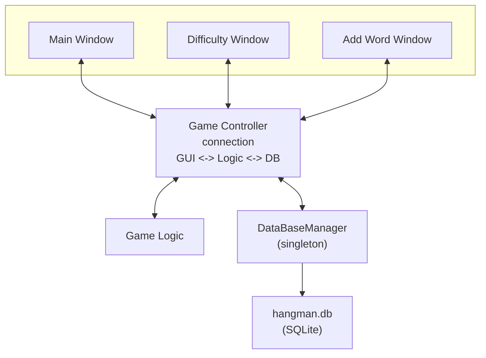

# C++ Hangman Game

[GitHub Repository](https://github.com/Dmitry_kitty/MyString)

Hangman is a classic word-guessing 
[game](https://simple.wikipedia.org/wiki/Hangman#:~:text=Hangman%20is%20a%20paper%20,76%20used%20for%20counting).
In this version, the words come from an educational C++ themed dictionary (C++ keywords and concepts). 
The player tries to guess a hidden word one letter at a time; each wrong guess draws part of a hangman figure. 
If the player completes the word before the figure is finished, they win; otherwise they lose.

---

## Key Features:

- **Difficulty Levels**: The game supports Easy, Medium, and Hard words.
- **Educational Dictionary**: All words are C++ terms (from `CSV/easy.csv`, `medium.csv`, `hard.csv`) with short definitions.
- **Add Custom Words**: Users can add their own C++-related words and definitions via the GUI.
- **Settings and Reset**: Players can clear their custom word list or change difficulty from the settings page.
- **Polished GUI**: The Qt-based interface shows hangman images for each incorrect guess, and dialogs include custom icons 
as per code changes above).

## Project logic and directory structure:
The diagram below illustrates how components interact: the MainWindow (UI) emits signals 
(e.g. *beginNewGame, guessLetter*) to the **GameController**, which in turn calls the GameLogic and updates 
the DataBase as needed. 


- GUI/ – Qt UI code and forms (mainwindow, dialogs). Contains `GUI/Source` (the `.cpp/.h` implementation) 
and GUI/Forms (`.ui` files).
- GameLogic/ – Core game logic (`Game.h/.cpp`) that manages the secret word, current display, and win/loss conditions.
- GameController/ – `GameController.h/.cpp` ties together the UI and game logic. 
It handles starting new games, processing guesses, and communicating with the database.
- DataBase/ – `DataBaseManager.h/.cpp` manages the SQLite database of words and stats.
Also includes the `load_words.py` script, which populates the database from CSV files.
- CSV/ – Contains `easy.csv`, `medium.csv`, and `hard.csv` with C++ keywords and definitions.
- Resources.qrc – Qt resource file listing images (hangman states, main menu background, etc.) 
that are embedded into the app.

```text
HangMan/
├── CMakeLists.txt
├── README.md
├── Resources.qrc
│
├── GUI/
│   ├── Forms/
│   │   ├── MainWindow.ui
│   │   ├── DifficultyDialog.ui
│   │   └── AddWordDialog.ui
│   ├── Source/
│   │   ├── main.cpp
│   │   └── windows.cpp/h
│   └── Resources/
│
├── GameLogic/
│   ├── Game.h
│   └── Game.cpp
│
├── GameController/
│   ├── GameController.h
│   └── GameController.cpp
│
├── DataBase/
│   ├── DataBaseManager.h
│   ├── DataBaseManager.cpp
│   └── load_words.py          # one-time import CSV → SQLite
│
└── CSV/
    ├── easy.csv
    ├── medium.csv
    └── hard.csv
```
- **Dictionary**: The word list is based on C++ concepts. 
Each CSV has rows like word,definition,difficulty. For example, “lambda” might 
appear in `medium.csv` with a short definition. The game randomly selects a word of the current difficulty from the 
SQLite database (which was populated by the provided `load_words.py` script). 
If you add a custom word, it’s stored in the database with `word_type='user'`.
## Game process:

## Building and Running:
1. **Qt Creator:** Open the folder HangMan in Qt Creator (which will detect the `CMakeLists.txt`). 
Configure your kit (ensuring Qt6 and a C++20 compiler), then Build and Run normally. 
Qt Creator will handle generating build files and linking against Qt6 Widgets and Sql (for SQLite).


2. **Command line (CMake):** In a terminal, run:
    ```bash
    mkdir build
    cd build
    cmake .. 
    cmake --build .
    ```
This uses the provided `CMakeLists.txt` (which sets `CMAKE_CXX_STANDARD 20` and includes 
Qt modules Qt6::Widgets, Qt6::Sql, etc.). On Windows, you may need to set `-DCMAKE_PREFIX_PATH` 
to your Qt installation (see Qt docs for details). Once built, copy the `hangman.db` file to the executable directory 
(or adjust the path), then run the HangManQT executable.